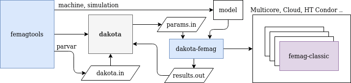

Dakota Integration
******************

`Dakota <https://dakota.sandia.gov>_` is an open source toolkit (GPL License)
for sensitivity analysis, uncertainty quantification,
model calibration and optimization  developped by
Sandia National Laboratories.

Example Parameter Study with Latin Hypercube Sampling::

  machine = dict(
      name="PM 130",
      poles=4,
      ...     
      stator=dict(
        num_slots=12,
        ..
        statorRotor3=dict(
          slot_width=3e-3,
          ... )  ),
      magnet=dict(
        ...
        magnetSector=dict(
          magn_shape=0.025,
          magn_width_pct=0.8,
          ... )  ),
      windings=dict(
        num_wires=20,
        .. )
  )
  
  parvar = {
    decision_vars = [
       {'bounds': [2e-3, 4e-3],
        'name': 'stator.statorRotor3.slot_width'},
       {'bounds': [0.75, 0.85],
        'name': 'magnet.magnetSector.magn_width_pct'},
       {'bounds': [0.021, 0.0335],
        'name': 'magnet.magnetSector.magn_shape'}
    ],
    objective_vars = [
      {'name': 'dqPar.torque[-1]', 'label': 'Load Torque/Nm'},
      {'name': 'torque[0].ripple', 'label': 'Cogging Torque/Nm'},
      {'name': 'torque[-1].ripple', 'label': 'Torque Ripple/Nm'}
    ]
  }

  simulation = dict(
    speed=5000.0 / 60,
    calculationMode="pm_sym_fast",
    magn_temp=20.0,
    wind_temp=60,
    period_frac=6,
    current=28.3,
    angl_i_up=0.0)

  workdir = pathlib.Path.home() / 'parstudy'
  workdir.mkdir(parents=True, exist_ok=True)
  
  sampling = femagtools.dakota.Sampling(workdir,
               magnetizingCurves=magnetizingCurve, magnets=magnetMat)

  # start calculation
  results = sampling(parvar, machine, simulation,
                     samples=100, partitions=6,
                     engine=dict(module='femagtools.multiproc'))
  
