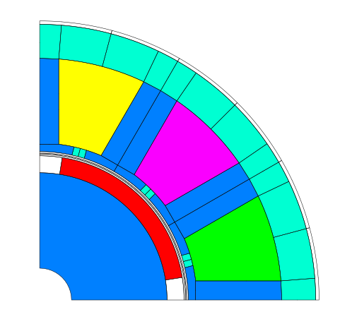

Introduction and Overview
*************************

This section presents an overview of the most typical
usage scenarios. Familiarity with the python programming
language is highly recommended.

.. note::
   consider the usage of logging when executing long running commands::

     import logging
     logging.basicConfig(level=logging.INFO,
                         format='%(asctime)s %(message)s')

Run FEMAG with FSL
++++++++++++++++++
Run a single calculation (single process)::

  workdir = pathlib.Path.home() / 'femag'
  femag = femagtools.Femag(workdir)
  femag.run('femag.fsl')

Run several calculations in parallel (multi processes)::

  engine = femagtools.multiproc.Engine()
  job = engine.create_job(workdir)
  for fsl in ('femag-1.fsl', 'femag-2.fsl', 'femag-3.fsl'):
      task = job.add_task()
      task.add_file(fsl)

  numtasks = engine.submit()
  status = engine.join()

.. note::
   Running femag simulations based on raw FSL files is discouraged.
   The recommended approach is to use Mako templates instead. The fsl module
   will then take care to create the fsl files. (Ref `fslmako`_)

Read BCH/BATCH File
+++++++++++++++++++
Read a BCH file and print the machine torque::

  bch = femagtools.read_bchfile('TEST_002.BCH')
  print(bch.machine['torque'])

Convert a BCH file to XML by command line::

  python -m femagtools.bchxml TEST_002.BCH

This command creates the file TEST_002.xml

Read I7/ISA7 or NC File
+++++++++++++++++++++++
Read an ISA7/I7 or NC File (filename extension is optional):

  >>> isa = femagtools.isa7.read('foo')
  >>> nc = femagtools.nc.read('foo')

Print Node coordinates::

  >>> n = isa.nodes[0]
  >>> print(n.x)
  (0.03380740433931351)
  >>> print(n.y)
  (0.009058667346835136)
  >>> print(n.xy)
  (0.03380740433931351, 0.009058667346835136)

Get an Element by key::

  >>> el = isa.elements[0]

Inspect Element properties::

  >>> el.mag
  (0.8485281467437744, 0.8485281467437744)
  >>> el.reluc
  (0.9523810148239136, 0.9523810148239136)

Get Node coordinates of Element::

  >>> el_coords = [v.xy for v in el.vertices]
  >>> print(el_coords)
  [(0.036389999091625214, 1.142020034095026e-09),
  (0.03499503806233406, 0.0005893968627788126),
  (0.03500000014901161, 0.0)]

Get a SuperElement by Element::

  >>> spel = isa.superelements[el.se_key]
  >>> el in spel.elements
  True

Plot SuperElements::

  from femagtools import isa7
  import matplotlib.pyplot as plt
  from femagtools import plot

  isa = isa7.read("PM_130_L4.ISA7")
  fig = plt.figure()
  ax = fig.add_subplot(111, aspect='equal')
  plot.spel(isa)
  plt.show()

.. _fslmako:

Create FSL and/or invoke FEMAG with Model Parameters
++++++++++++++++++++++++++++++++++++++++++++++++++++
This is the recommended approach to work with FEMAG.
A machine model is defined with a python dictionary that includes
3 child dictionaries: stator, rotor or magnet and windings.
The final FSL file is then created from Mako templates by a rendering process.
Various templates are included in femagtools but users can also use
their own.

Here is an example which creates a FE model from the built-in
templates stator1 and magnetSector::

  machine = dict(
     name = "PM 130 L4",
     lfe = 0.1,
     poles = 4,
     outer_diam = 0.13,
     bore_diam = 0.07,
     inner_diam = 0.015,
     airgap = 0.001,

     stator = dict(
         num_slots = 12,
         mcvkey_yoke = "dummy",
         rlength = 1.0,
         stator1 = dict(
             slot_rf1 = 0.057,
             tip_rh1 = 0.037,
             tip_rh2 = 0.037,
             tooth_width = 0.009,
             slot_width = 0.003)
	 ),

     magnet = dict(
         mcvkey_shaft = "dummy",
         mcvkey_yoke = "dummy",
         magnetSector = dict (
	     magn_num = 1,
	     magn_width_pct = 0.8,
	     magn_height = 0.004,
	     magn_shape = 0.0,
	     bridge_height = 0.0,
	     magn_type = 1,
	     condshaft_r = 0.02,
	     magn_ori = 2,
	     magn_rfe = 0.0,
	     bridge_width = 0.0,
	     magn_len = 1.0 )
	 ),

      windings = dict(
           num_phases = 3,
           num_wires = 100,
           coil_span = 3.0,
           num_layers = 1)
  )

  fsl = femagtools.create_fsl(model)
  with open('femag.fsl', 'w') as f:
      f.write('\n'.join(fsl))

After opening this file in FEMAG the shown geometry is created:

.. image:: img/geom.png
   :height: 240pt

It is not necessary to create FSL files. Machine models defined by
such dictionaries can be used with simulation parameters to
run FEMAG directly::

  femag = femagtools.Femag(workdir)

  simulation = dict(
    calculationMode="pm_sym_fast",
    current=50.0,
    angl_i_up=0.0,
    speed=50.0,
    wind_temp=60.0,
    magn_temp=60.0)

  r = femag(machine, simulation))

  print('Torque [Nm] = {}'.format(r.machine['torque']))

As with the model and winding geometries
various simulation templates are included in femagtools.

Machine Sizing
++++++++++++++

A model dictionary can be created for different machine types (SPM, IPM, EESM, IM)
by using a simple
set of requirements such as power, speed, voltage and pole pairs::

  p2 = 1.5e3
  speed = 1500/60
  udc = 550
  p = 4

  machine = femagtools.machine.sizing.spm(
          p2, speed, p, udc=udc)

There are a couple of additional parameters such as shear stress, current density
stack length/pole pitch ratio etc. (Ref `Sizing`_)

Evaluate PM/Reluctance machine characteristics
++++++++++++++++++++++++++++++++++++++++++++++

For the fast evaluation of
machine characteristics such speed, torque, losses etc. several
analytical models are provided. Her is an example of a PM
or reluctance machine using Ld-Lq parameters::

  p = 4
  r1 = 0.0806
  ls = 0.0
  ld = [1.4522728e-3, 1.4522728e-3]
  lq = [3.2154e-3, 3.8278836e-3]
  psim = [0.11171972, 0.11171972]
  i1 = [80.0]
  beta = [0.0, -41.1]

  pm = femagtools.machine.PmRelMachineLdq(3, p,
                                          psim,
                                          ld,
                                          lq,
                                          r1,
                                          beta,
                                          i1)

Calculation of minimal current and frequency at given torque and max voltage::

  tq = 170.0
  u1 = 340.0

  iqx, idx = pm.iqd_torque(tq)
  w1 = pm.w1_u(u1, idx, iqx)
  i1 = np.linalg.norm(np.array((iqx, idx)))

.. plot:: pyplots/pmfieldweak.py

Speed-Torque characteristics with max power::

  def torque(T, pmax, wm):
      """shaft torque as a function of rotor angular speed"""
      if wm <= pmax / T:
          return T
      return pmax / wm

  pmax = 60e3
  n = np.linspace(0, 75, 20)
  T = [torque(Tmax, pmax, 2*np.pi*nx) for nx in n]
  r = pm.characteristics(T, n, u1)

.. plot:: pyplots/pmchar.py

Parameter Identification
++++++++++++++++++++++++

The parameters of the analytical model such inductances, resistances etc.
can be determined fastly based on the model dict::

  machine = {
    'poles': 4,
    'outer_diam': 0.220,
    'bore_diam': 0.125,
    .. }
   engine = femagtools.multiproc.Engine()
   dqpars = femagtools.machine.pm.parident(
      workdir, engine, temp=[60, 90],
      machine=machine,
      magnetizingCurves=magnetizingCurves,
      magnetMat=magnetMat,
      condMat=condMat)

Execute Parameter Variations
++++++++++++++++++++++++++++

Example: calculate torque, torque ripple and iron losses at beta=-50°,-25°,0°::

  parvar = {
    "objective_vars": [
      {"name": "dqPar.torque[-1]"},
      {"name": "torque[-1].ripple"},
      {"name": "machine.plfe[-1]"}],
    "population_size": 3,
    "decision_vars": [
      {"steps": 3,
       "bounds": [-50, 0],
       "name": "angl_i_up"}
  }

  operatingConditions = dict(
    angl_i_up=0.0,
    calculationMode="pm_sym_fast",
    wind_temp=60.0,
    magn_temp=60.0,
    current=50.0,
    speed=50.0)

  numcores = 3
  engine = femagtools.multiproc.Engine(numcores)

  mcvDir = pathlib.Path.home() / 'mcv'

  g = femagtools.parstudy.Grid(workdir,
                           magnetizingCurves=mcvDir)

  results = g(parvar, pmMachine,
              operatingConditions, engine)

The variable results is a dict with the keys x and f holding the (n x m) arrays of the decision and the objective variables.

Make a Multi-Objective Optimization
+++++++++++++++++++++++++++++++++++

Example: minimize ripple and losses and maximize torque (note the sign parameter) by varying magnet width and height ::

  optdef = {
    "objective_vars": [
        {"name": "dqPar.torque[-1]", "desc": "Torque / Nm", "sign": -1},
        {"name": "torque[0].ripple", "desc": "Torque Ripple / Nm"},
        {"name": "machine.plfe[-1]", "desc": "Iron Loss / W" }
    ],
    "population_size": 24,
    "decision_vars": [
        {"name": "magnet.magnetSector.magn_width_pct",
	 "desc": "Magn width",
	 "bounds": [0.75, 0.85]},

        {"name": "magnet.magnetSector.magn_height",
	 "desc": "Magn height",
	 "bounds": [3e-3, 5e-3]}

    ]
  }

  engine = femagtools.condor.Engine()
  opt = femagtools.opt.Optimizer(workdir,
                                 magnetizingCurve, magnetMat)

  num_generations = 3
  results = opt.optimize(num_generations,
                         optdef, machine, operatingConditions, engine)
