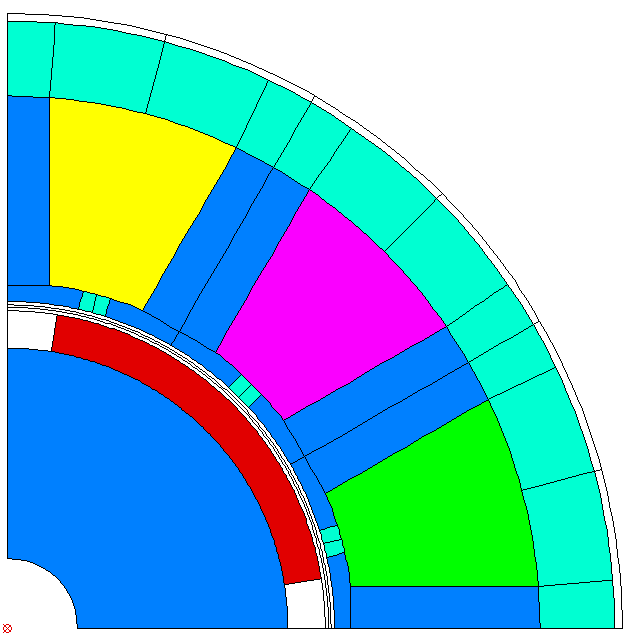

Introduction and Overview
*************************

Run FEMAG with FSL
++++++++++++++++++
Run a single calculation (single process)::
  
  workdir = os.path.join(os.path.expanduser('~'), 'femag')
  femag = femagtools.Femag(workdir)
  femag.run('femag.fsl')

Run several calculations in parallel (multi processes)::

  engine = femagtools.multiproc.Engine()
  job = engine.create_job(workdir)
  for fsl in ('femag-1.fsl', 'femag-2.fsl', 'femag-3.fsl'):
      task = job.add_task()
      task.add_file(fsl)

  numtasks = engine.submit()
  status = engine.join()
  
Read BCH/BATCH File
+++++++++++++++++++
Read a BCH file and print the machine torque::

  bch = femagtools.read_bchfile('TEST_002.BCH')
  print(bch.machine['torque'])

Convert a BCH file to XML by command line::

  python -m femagtools.bchxml TEST_002.BCH

This command creates the file TEST_002.xml

Create FSL and/or invoke FEMAG with Model Parameters
++++++++++++++++++++++++++++++++++++++++++++++++++++
Create a FE model from the templates stator1 and magnetSector::

  machine = dict(
     name = "PM 130 L4",
     lfe = 0.1,
     poles = 4,
     outer_diam = 0.13,
     bore_diam = 0.07,
     inner_diam = 0.015,
     airgap = 0.001,
     
     stator = dict(
         num_slots = 12,
         num_slots_gen = 3,
         mcvkey_yoke = "dummy",
         rlength = 1.0,
         stator1 = dict(
             slot_rf1 = 0.057,
             tip_rh1 = 0.037,
             tip_rh2 = 0.037,
             tooth_width = 0.009,
             slot_width = 0.003)
	 ),

     magnet = dict(
         mcvkey_mshaft = "dummy",
         mcvkey_yoke = "dummy",
         magnetSector = dict (
	     magn_num = 1,
	     magn_width_pct = 0.8,
	     magn_height = 0.004,
	     magn_shape = 0.0,
	     bridge_height = 0.0,
	     magn_type = 1,
	     condshaft_r = 0.02,
	     magn_ori = 2,
	     magn_rfe = 0.0,
	     bridge_width = 0.0,
	     magn_len = 1.0 )
	 ),

      windings = dict(
           num_phases = 3,
           num_wires = 100,
           coil_span = 3.0,
           num_layers = 1)
  )
  
  fsl = femagtools.create_fsl(model)
  with open('femag.fsl', 'w') as f:
      f.write('\n'.join(fsl))

After opening this file in FEMAG the shown geometry is created:

The same machine and operating parameters can be used to run FEMAG directly::

  femag = femagtools.Femag(workdir)

  operatingConditions = dict(
    calculationMode="pm_sym_fast",
    current=50.0,
    angl_i_up=0.0,
    speed=50.0,
    wind_temp=60.0,
    magn_temp=60.0)

  r = femag(machine,
            operatingConditions)

  print('Torque [Nm] = {}'.format(r.machine['torque']))

Evaluate PM/Reluctance machine characteristics
++++++++++++++++++++++++++++++++++++++++++++++

Definition of the PM or Reluctance machine with Ld,Lq parameters::

  p = 4
  r1 = 0.0806
  le = 0.0
  ls = 0.0
  wind_temp = 20.0
  ld = [0.0014522728, 0.0014522728]
  lq = [0.0032154, 0.0038278836]
  psim = [0.11171972000000001, 0.11171972000000001]
  i1 = [80.0]
  beta = [0.0, -41.1]

  pm = femagtools.machine.PmRelMachineLdq(3, p,
                                          psim,
                                          ld,
                                          lq,
                                          r1,
                                          beta,
                                          i1)

Calculation of minimal current and frequency at given torque and max voltage::

  tq = 170.0
  u1 = 340.0

  iqx, idx = pm.iqd_torque(tq)
  w1 = pm.w1_u(u1, idx, iqx)
  i1 = np.linalg.norm(np.array((iqx, idx)))

.. plot:: pyplots/pmfieldweak.py
      
Speed-Torque characteristics with max power::

  def torque(T, pmax, wm):
      """shaft torque as a function of rotor angular speed"""
      if wm <= pmax / T:
          return T
      return pmax / wm

  pmax = 60e3
  n = np.linspace(0, 75, 20)
  T = [torque(Tmax, pmax, 2*np.pi*nx) for nx in n]
  r = pm.characteristics(T, n, u1)

.. plot:: pyplots/pmchar.py
  

Execute Parameter Variations
++++++++++++++++++++++++++++

Example: calculate torque, torque ripple and iron losses at beta=-50°,-25°,0°::

  parvar = {
    "objective_vars": [
      {"name": "dqPar.torque"},
      {"name": "torque.ripple"},
      {"name": "machine.plfe"}],
    "population_size": 3,
    "decision_vars": [
      {"steps": 3,
       "bounds": [-50, 0],
       "name": "angl_i_up"}
  }
  
  operatingConditions = dict(
    angl_i_up=0.0,
    calculationMode="pm_sym_fast",
    wind_temp=60.0,
    magn_temp=60.0,
    current=50.0,
    speed=50.0)
    
  numcores = 3
  engine = femagtools.multiproc.Engine(numcores)

  mcvDir = os.path.join(
            os.path.expanduser('~'), 'mcv')

  g = femagtools.grid.Grid(workdir,
                           magnetizingCurves=mcvDir)

  results = g(parvar, pmMachine,
              operatingConditions, engine)

The variable results is a dict with the keys x and f holding the (n x m) arrays of the decision and the objective variables.
  
Make a Multi-Objective Optimization
+++++++++++++++++++++++++++++++++++

Example: minimize ripple and losses and maximize torque (note the sign parameter) by varying magnet width and height ::
  
  opt = {
    "objective_vars": [
        {"name": "dqPar.torque", "desc": "Torque / Nm", "sign": -1},
        {"name": "torque.ripple", "desc": "Torque Ripple / Nm"},
        {"name": "machine.plfe", "desc": "Iron Loss / W" }
    ],
    "population_size": 24,
    "decision_vars": [
        {"name": "magnet.magnetSector.magn_width_pct",
	 "desc": "Magn width", 
	 "bounds": [0.75, 0.85]},
         
        {"name": "magnet.magnetSector.magn_height",
	 "desc": "Magn height",
	 "bounds": [3e-3, 5e-3]}
         
    ]
  }

  engine = femagtools.condor.Engine()
  o = femagtools.opt.Optimizer(workdir,
                               magnetizingCurve, magnetMat)

  num_generations = 3
  results = o.optimize(num_generations,
                       opt, machine, operatingConditions, engine)

