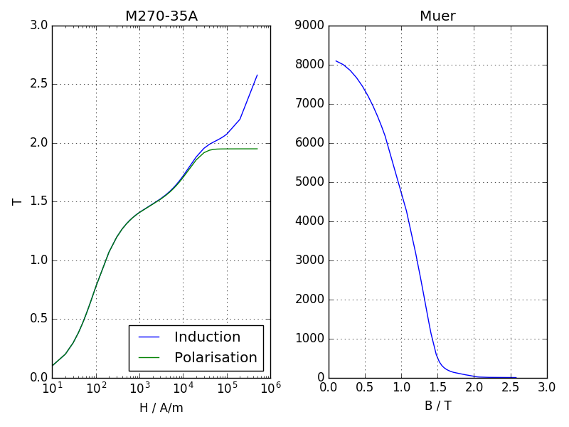

Models
******

The models are dictionaries with the properties of a machine or a calculation.

Machine
=======

Machines have a set of basic parameters, a stator, a magnet and a winding:

==============  =============================  ======
Parameter        Description                   Unit
==============  =============================  ======
name             Name of machine
lfe              Lenght of iron                 m
poles            Number of poles
outer_diam       Outer diameter (yoke side)     m
bore_diam        Bore diameter  (airgap side)   m
inner_diam       Inner diameter (yoke)          m
airgap           airgap width                   m
external_rotor   True, False                    False
==============  =============================  ======

Stator
------

Stators have basic parameters and slots:

==============  ============================  =====================
Parameter        Description                  Default  
==============  ============================  =====================
num_slots        Number of Slots Q
num_slots_gen    Number of Slots in Model      m*Q/gcd(Q, 2p*m)
rlength          Relative iron length          1.0
mcvkey_yoke      Name of lamination material   dummy
nodedist         Factor for node distance      1.0
==============  ============================  =====================

.. note::

   if no value for num_slots_gen is given its value is calculated from the the number of slots Q and pole pairs p. (version added 0.0.16)

Slots
^^^^^
============    ==============  
Name             Parameter      
============    ==============  
stator1  
                 slot_rf1,
                 tip_rh1,
                 tip_rh2, 
                 tooth_width,
                 slot_width
stator2
                 slot_t1,
                 slot_t2,        
                 slot_t3,         
                 slot_depth,      
                 slot_width,      
                 corner_width    
statorRotor3
                 slot_height,
                 slot_h1,    
                 slot_h2,    
                 slot_width, 
                 slot_r1,    
                 slot_r2,
                 wedge_width1,
                 wedge_width2,
                 middle_line, 
                 tooth_width, 
                 slot_top_sh 
stator4
                 slot_height,
                 slot_h1,    
                 slot_h2,    
                 slot_h3,    
                 slot_h4,
                 slot_width, 
                 slot_r1,    
                 wedge_width1,
                 wedge_width2,
                 wedge_width3
statorBG
                 yoke_diam_ins
                 slot_h1,    
                 slot_h3,    
                 slot_width, 
                 slot_r1,    
                 slot_r2,
                 middle_line, 
                 tooth_width,
		 tip_rad,
                 slottooth
============    ==============  

.. note::

   All units are metric units.

Windings
--------

============    ============================  =======
Name             Parameter                    Default
============    ============================  =======
num_phases      number of phases (m)
num_wires       number of wires per slot
coil_span       coil span
num_layers      number of layers
cufilfact       Fill factor of copper          0.45
culength        rel length of conductor        1.4
slot_indul      insulation thickness in slot   0.0 
============    ============================  =======

Magnet
------

Magnets have basic parameters and slots:

==============  ================================  =======  
Parameter        Description                      Default  
==============  ================================  =======  
mcvkey_yoke      Name of lamination material      dummy
mcvkey_shaft     Name of shaft material           dummy
material         Name of magnet material
nodedist         Factor for node distance         1.0
==============  ================================  =======

.. note::

   * the mcvkey parameters either reference a filename without extension (Example 'M330-50A') which must be found in the directory defined by the parameter magnetizingCurves of the Femag constructor or the name of an entry in the magnetizingCurve object.
   * the material parameter references a name of the 'Magnet Material'_ list. 

Slots
^^^^^

============    ==============
Name             Parameter      
============    ==============
magnetSector    magn_num,
                magn_width_pct,
                magn_height,
                magn_shape,
                bridge_height,
                magn_type,
                condshaft_r,
                magn_ori,
                magn_rfe,
                bridge_width,
                magn_len
magnetIron      magn_height,
                magn_width,
		gap_ma_iron,
		air_triangle,
		iron_height,
		magn_rem,
		condshaft_r,
		magn_ori,
		bridge_height,
		bridge_width,
		iron_shape
magnetIron2     magn_height,
                magn_width,
		gap_ma_iron,
		air_triangle,
		iron_height,
		magn_rem,
		condshaft_r,
		gap_ma_right,
		gap_ma_left,
		magn_ori,
		iron_shape
magnetIron3     magn_height,
                iron_bfe,
		gap_ma_iron,
		air_triangle,
		iron_height,
		gap_ma_right,
		gap_ma_left,
		condshaft_r,
		magn_num,
		magn_ori,
		iron_shape
magnetIron4     magn_height,
                magn_width,
		gap_ma_iron,
		iron_shape,
		air_space_h,
		iron_bfe,
		magn_di_ra,
		corner_r,
		air_sp_ori,
		magn_ori,
		magn_num
magnetIron5     magn_height,
                magn_width,
		gap_ma_iron,
		iron_bfe,
		air_space_h,
		corner_r,
		air_sp_ori,
		magn_num,
		iron_shape,
		air_space_b,
		magn_di_ra
magnetIronV     magn_height,
                magn_width,
		magn_angle,
		magn_num,
		iron_hs,
		iron_height,
		iron_shape,
		air_triangle,
		gap_ma_iron,
		magn_rem,
		condshaft_r
magnetFC2       yoke_height,
                iron_h1,
		iron_h2,
		iron_b,
		magn_width,
		magn_height,
		iron_bfe,
		iron_bfo,
		iron_shape,
		iron_hp,
		magn_num
============    ==============

Example::
  
  machine = dict(
     name="PM 130 L4",
     lfe=0.1,
     poles=4,
     outer_diam=0.13,
     bore_diam=0.07,
     inner_diam=0.015,
     airgap=0.001,
     
     stator=dict(
         num_slots=12,
         num_slots_gen=3,
         mcvkey_yoke="dummy",
         rlength=1.0,
         stator1=dict(
             slot_rf1=0.057,
             tip_rh1=0.037,
             tip_rh2=0.037,
             tooth_width=0.009,
             slot_width=0.003)
	 ),

     magnet=dict(
         mcvkey_shaft="dummy",
         mcvkey_yoke="dummy",
         magnetSector=dict (
	     magn_num=1,
	     magn_width_pct=0.8,
	     magn_height=0.004,
	     magn_shape=0.0,
	     bridge_height=0.0,
	     magn_type=1,
	     condshaft_r=0.02,
	     magn_ori=2,
	     magn_rfe=0.0,
	     bridge_width=0.0,
	     magn_len=1.0 )
	 ),

      windings=dict(
           num_phases=3,
           num_wires=100,
           coil_span=3.0,
           num_layers=1)
  )
  
Magnetizing Curve
=================

The MagnetizingCurve is a container of magnetizing curves (eg. lamination or PM material) that can be referenced by the model mcvkey attributes. It can either point to a directory of MC/MCV-File or hold a list of magnet curves which are identified by name.

Each magnetizing curve is described by the following properties

================  ================================ ======== =======
Attribute          Description                     Unit     Default
================  ================================ ======== =======
   name           Identifier of this curve
   ctype          Type of curve                             1
   desc           Description
   curve          List of dictionaries with
                  bi (list of induction values)    T,
                  hi (List of field strength       A/m,
		  values) and angle which can      deg
                  be missing in case of 1 curve
   ch             hysteresis loss factor                    0
   cw             eddy current loss factor                  0
   ch_freq        hysteresis exponent                       0
   cw_freq        eddy-current exponent                     0
   b_coeff        induction loss exponent                   0
   Bo             reference induction              T        1.5
   fo             reference frequency              Hz       50
   fillfac        iron fill factor                          1
   bsat           saturation induction             T        2.15
   rho            specific weight                  kg/dm3   7.65
================  ================================ ======== =======

The loss factors and exponents are used in the Jordan loss calculation formula:

 (cw*(f/fo)**cw_freq + ch*(f/fo)**ch_freq)*(B/Bo)**b_coeff

The Reader object which is included in the mcv module can be used to read MCV/MC files.

Permeability and polarisation calculation example::

  MUE0 = 4e-7*math.pi

  mcv = femagtools.mcv.Reader()
  mcv.readMcv('magnetcurves/M270-35A.MCV')
  r = mcv.get_results()

  bh = [(bi, hi)
        for bi, hi in zip(r['curve'][0]['bi'],
                          r['curve'][0]['hi']) if bi > 0 and hi > 0]

  ji = [b-MUE0*h for b, h in bh]
  muer = [bx/hx/MUE0 for bx, hx in bh]

Using a magnetizingcurve to write a mcv file::

   mcvData = dict(curve=[ dict(
      bi=[0.0, 0.09, 0.179, 0.267, 0.358,
          0.45, 0.543, 0.6334, 0.727,
          0.819, 0.9142, 1.0142, 1.102,
          1.196, 1.314, 1.3845, 1.433,
          1.576, 1.677, 1.745, 1.787,
          1.81, 1.825, 1.836],
        
       hi=[0.0, 22.16, 31.07, 37.25, 43.174,
           49.54, 56.96, 66.11, 78.291,
           95, 120.64, 164.6, 259.36,
           565.86, 1650.26, 3631.12, 5000, 10000,
           15000, 20000, 25000, 30000, 35000, 40000]
       )],
       name='m270-35a',
       desc=u"Demo Steel",
       ch=4.0,
       cw_freq=2.0,
       cw=1.68)

    mcv = femagtools.mcv.MagnetizingCurve(mcvData)
    
    mcv.writefile('m270-35a')

.. note::

   if the curve data is used in a stator or magnet slot model there is no need to create the file explicitly. Femagtools will take care of that during the model creation.
   
Magnet Material
===============

list of dict objects each having a unique name (or id) and a set of parameters
that describe the magnet properties.

==============   ============================== ==========  ============
Parameter         Description                   Default      Unit
==============   ============================== ==========  ============
name              Name of magnet material
mcvkey            name of nonlinear B(H) curve
orient            Magnetizing orientation       mpolaniso
rlen              Relative length                1.0
remanenc          Remanence Induction Br                    T
relperm           Relative Permeability
spmaweight        Specific Mass                  7500       kg/m³
temcoefbr         Temperature Coefficient of Br  -0.001     T/K 
temcoefhc         Temperature Coefficient of Hc  -0.001     A/m/K
magntemp          Magnet Temperature             20         °C      
magncond          Electr. Conductivity           625000      S/m    
magnwidth         Magnet width                    0.0       m     
magnlength        Magnet length in z direction   0.0        m      
==============   ============================== ==========  ============

.. note::

  * name must be unique within list. It may be used as reference in the magnet model of the machine.
    
    Example::
    
      magnets = [dict(name='MX-333', remanenc=1.2, relperm=1.05)]

  * mcvkey is used for material that have a non-linear BH curve.
  * the key orient describes the field orientation (mcartiso, mpoliso, martaniso, mpolaniso)
  * rlen defines the relative length
    
     Example::
       
       magnets=[dict(name='BH53M', mcvkey='BH53M',
                     orient='mcartiso', rlen=1.0)]
		     
  * The mcvkey can either reference a file or an entry in the magnetizing curve dict.

.. include:: userspec.rst

Calculation
===========

Cogging (cogg_calc)

==============  ============================= ==========  ============
Parameter        Description                   Default      Unit
==============  ============================= ==========  ============
speed           Speed                                     1/s
skew_angle      Skewing angle                   0         deg
num_skew_steps  Number of skew steps            0
magn_temp       Magnet Temperature                        °C
num_move_steps  Number of move steps
num_par_wdgs    Number of parallel windings     1      
eval_force      Evaluate force                  0
plots           Create plots                    []
==============  ============================= ==========  ============

.. note::
   
   plots is a list of field_lines or color_gradation plots to be created after the calculation. Possible values
   'field-lines', 'Babs', 'Br', 'Bx', 'By', 'Br', 'Bt', 'Habs', 'Hx', 'Hy', 'Hr', 'Ht'
   'demag', 'ecurr', 'ecloss', 'relperm', 'Wm', 'Bdev', 'Vpot'. (See http://script.profemag.ch/ColorGrad.html) added in version 0.0.16
   
Example::

  operatingConditions = dict(
    calculationMode="cogg_fast",
    magn_temp=60.0,
    num_move_steps=49,
    speed=50.0,
    plots=['field_lines', 'Babs'])

PM/Rel Machine Simulation (pm_sym_fast)

==============  ============================= ==========  ============
Parameter        Description                   Default      Unit
==============  ============================= ==========  ============
speed           Speed                                     1/s
skew_angle      Skewing angle                   0         deg
num_skew_steps  Number of skew steps            0
magn_temp       Magnet Temperature                        °C
wind_temp       Winding Temperature             20        °C
num_move_steps  Number of move steps            49
num_par_wdgs    Number of parallel windings     1      
eval_force      Evaluate force                  0         
current         Phase current                             A (RMS)
angl_i_up       Angle I vs. Up                  0         deg
optim_i_up      Optimize Current                0
plots           Create plots                    []
==============  ============================= ==========  ============

Example::

  operatingConditions = dict(
    calculationMode="pm_sym_fast",
    wind_temp=60.0,
    magn_temp=60.0,
    current=50.0,
    speed=50.0)
  
Ld-Lq Identification (ld_lq_fast)

==============  ============================= ==========  ============
Parameter        Description                   Default      Unit
==============  ============================= ==========  ============
speed           Speed                                     1/s
skew_angle      Skewing angle                   0         deg
num_skew_steps  Number of skew steps            0
magn_temp       Magnet Temperature                        °C
num_move_steps  Number of move steps
num_par_wdgs    Number of parallel windings     1      
eval_force      Evaluate force                  0         
i1_max          Max. phase current                        A (RMS)
beta_min        Min. Beta angle                           deg
beta_max        Max. beta angle                           deg
num_cur_steps   Number of current steps
num_beta_steps  Number of beta steps
plots           Create plots                    []
==============  ============================= ==========  ============

Example::

  feapars = dict(
    num_move_steps=25,
    calculationMode="ld_lq_fast",
    magn_temp=60.0,
    i1_max=150.0,
    beta_max=0.0,
    beta_min=-60.0,
    num_cur_steps=3,
    num_beta_steps"=4,
    speed=50.0)
  

Psid-Psiq Identification (psd_psq_fast)

==============  ============================= ==========  ============
Parameter        Description                   Default      Unit
==============  ============================= ==========  ============
speed           Speed                                     1/s
skew_angle      Skewing angle                   0         deg
num_skew_steps  Number of skew steps            0
magn_temp       Magnet Temperature                        °C
num_move_steps  Number of move steps
num_par_wdgs    Number of parallel windings     1      
eval_force      Evaluate force                  0         
max_id          Max. Amplitude Id current                 A 
min_id          Min. Amplitude Id current                 A 
max_iq          Max. Amplitude Iq current                 A 
min_iq          Min. Amplitude Iq current                 A 
delta_id        Delta of Id current steps                 A
delta_iq        Delta of Iq current steps                 A
plots           Create plots                    []
==============  ============================= ==========  ============

Example::

  feapars = dict(
    num_move_steps=25,
    calculationMode="psd_psq_fast",
    magn_temp=60.0,
    max_id=0.0,
    min_id=-150.0,
    max_iq=150.0
    min_iq=0.0,
    delta_id=50.0,
    delta_iq=50.0,
    speed=50.0)

    
PM/Rel Machine Simulation (pm_sym_fast)

==============  ============================= ==========  ============
Parameter        Description                   Default      Unit
==============  ============================= ==========  ============
speed           Speed                                     1/s
skew_angle      Skewing angle                   0         deg
num_skew_steps  Number of skew steps            0
magn_temp       Magnet Temperature                        °C
wind_temp       Winding Temperature             20        °C
num_move_steps  Number of move steps            49
num_par_wdgs    Number of parallel windings     1      
current         Phase current                             A (RMS)
angl_i_up       Angle I vs. Up                  0         deg
==============  ============================= ==========  ============

Example::

  operatingConditions = dict(
    calculationMode="torq_calc",
    wind_temp=60.0,
    magn_temp=60.0,
    current=50.0,
    angl_i_up=0.0,
    speed=50.0)

Calculation with existing model
-------------------------------

FE calculations can be executed for existing models also.
Since Femag Rel 8.3 there is no need to fully specify the machine model::

  machine = "PM 270 L8"

  workdir = os.path.join(
    os.path.expanduser('~'), 'femag')

  femag = femagtools.Femag(workdir)

  operatingConditions = dict(
    angl_i_up=-38.7,
    calculationMode="pm_sym_fast",
    magn_temp=60.0,
    num_move_steps=25,
    speed=50.0,
    wind_temp=60.0,
    current=108.0)

  r = femag(machine,
            operatingConditions)

For older versions the minimal data is::

  machine = dict(
      name="PM 130 L4",
      lfe=0.1,
      poles=4,
      outer_diam=0.13,
      bore_diam=0.07,
      airgap=0.001,
     
      stator=dict(
          num_slots=12,
          num_slots_gen=3,
          mcvkey_yoke="dummy"
      )
  )
