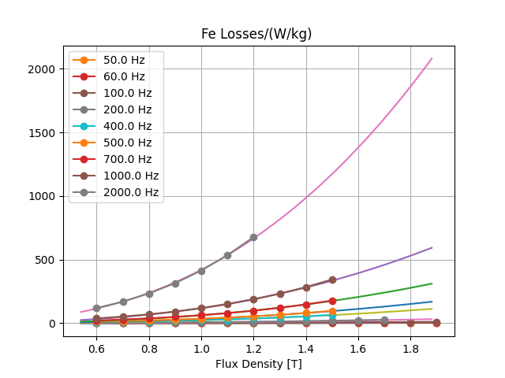

**Material**
============

.. _conductor:

Conductors
----------

The conductors is a list of dict items that describe the material properties of

==============  ======== ===============================================
Name            Unit     Description
==============  ======== ===============================================
name                     identifier
desc
spmaweight      g/cm³    specific mass (density)
elconduct       S/m      electrical conductivity at 20°C
tempcoef        1/K      temperature coefficient
thcond          W/(m K)  thermal conductivity
thcap           J/K      thermal capacity
==============  ======== ===============================================

Example::

  condMat = [
    {"name": "Al", "spmaweight": 2.7,
     "elconduct": 33e6, "tempcoef": 3.9e-3},
    {"name": "Cu", "spmaweight": 8.96,
     "elconduct": 56e6, "tempcoef": 3.9e-3} ]

.. _magnetizingCurve:

Magnetizing Curve
-----------------

The MagnetizingCurve is a container of magnetizing curves (eg. lamination or PM material) that can be referenced by the model mcvkey attributes. It can either point to a directory of MC/MCV-File or hold a list of magnet curves which are identified by name.

Each magnetizing curve is described by the following properties

=========  ================================ ======== =======
Attribute  Description                      Unit     Default
=========  ================================ ======== =======
name       Identifier of this curve
ctype      Type of curve                             1
desc       Description
curve      List of dictionaries with
           bi (list of induction values)    T,
           hi (List of field strength       A/m,
           values) and angle which can      deg
           be missing in case of 1 curve
ch         hysteresis loss factor                    0
cw         eddy current loss factor                  0
ch_freq    hysteresis exponent                       0
cw_freq    eddy-current exponent                     0
b_coeff    induction loss exponent                   0
Bo         reference induction              T        1.5
fo         reference frequency              Hz       50
fillfac    iron fill factor                          1
bsat       saturation induction             T        2.15
rho        specific weight                  kg/dm3   7.65
losses     dict of loss values (optional)
=========  ================================ ======== =======

The loss factors and exponents are used in the Jordan loss calculation formula:

 (cw*(f/fo)**cw_freq + ch*(f/fo)**ch_freq)*(B/Bo)**b_coeff

The Reader object which is included in the mcv module can be used to read MCV/MC files.

Permeability and polarisation calculation example::

  MUE0 = 4e-7*math.pi

  mcv = femagtools.mcv.Reader()
  mcv.readMcv('magnetcurves/M270-35A.MCV')
  r = mcv.get_results()

  bh = [(bi, hi)
        for bi, hi in zip(r['curve'][0]['bi'],
                          r['curve'][0]['hi']) if bi > 0 and hi > 0]

  ji = [b-MUE0*h for b, h in bh]
  muer = [bx/hx/MUE0 for bx, hx in bh]

Using a magnetizingcurve to write a mcv file::

   mcvData = dict(curve=[ dict(
      bi=[0.0, 0.09, 0.179, 0.267, 0.358,
          0.45, 0.543, 0.6334, 0.727,
          0.819, 0.9142, 1.0142, 1.102,
          1.196, 1.314, 1.3845, 1.433,
          1.576, 1.677, 1.745, 1.787,
          1.81, 1.825, 1.836],

       hi=[0.0, 22.16, 31.07, 37.25, 43.174,
           49.54, 56.96, 66.11, 78.291,
           95, 120.64, 164.6, 259.36,
           565.86, 1650.26, 3631.12, 5000, 10000,
           15000, 20000, 25000, 30000, 35000, 40000]
       )],
       name='m270-35a',
       desc=u"Demo Steel",
       ch=4.0,
       cw_freq=2.0,
       cw=1.68)

    mcv = femagtools.mcv.MagnetizingCurve(mcvData)

    mcv.writefile('m270-35a')

.. image:: ../img/mcv.png
  :height: 290pt

.. Note::

   if the curve data is used in a stator or magnet slot model there is no need to create the file explicitly. Femagtools will take care of that during the model creation.

Loss Values:

=======  ============================  ==== ====
Key                                    unit dim.
=======  ============================  ==== ====
B        list of flux density values    T    n
f        list of frequency values       Hz   m
pfe      list of loss values                nxm
cw       eddy current loss coeff
cw_freq  eddy current exp
b_coeff  flux density exp
fo       base frequency
Bo       base flux density
=======  ============================  ==== ====

Example::

 {"B": [0.25, 0.5, 0.75, 1.0, 1.25, 1.5, 1.8],
  "f": [50.0, 400.0, 1000.0],
  "pfe": [[0.08,  0.29, 0.56, 0.92, 1.44, 2.25, 2.94],
          [0.137, 4.73, 9.87, 20.3, 31.7],
          [5.5,  18.5, 25.8,  71.5]],
  "cw": 1.248, "cw_freq": 1.6631, "b_coeff": 2.19661, "fo": 50.0, "Bo": 1.5}

.. Note::

   missing values are extrapolated using the steinmetz formula

.. _magnetMaterial:

Magnet Material
---------------

list of dict objects each having a unique name (or id) and a set of parameters
that describe the magnet properties.

==============   ============================== ==========  ========
Parameter         Description                   Default      Unit
==============   ============================== ==========  ========
name              Name of magnet material
mcvkey            name of nonlinear B(H) curve
orient            Magnetizing orientation        cartiso
rlen              Relative length                1.0
remanenc          Remanence Induction Br                    T
relperm           Relative Permeability
spmaweight        Specific Mass                  7500       kg/m³
temcoefbr         Temperature Coefficient of Br  -0.001     1/K
temcoefhc         Temperature Coefficient of Hc  -0.001     A/m/K
magntemp          Magnet Temperature             20         °C
magncond          Electr. Conductivity           625000      S/m
magnwidth         Magnet segment width (obsol.)  0.0         m
magnlength        Magn. segment length (obsol.)  0.0         m
magnsegwidth      Magnet segment width           0.0         m
magnseglength     Magnet segment length          0.0         m
==============   ============================== ==========  ========

.. Note::

  * name must be unique within list. It may be used as reference in the magnet model of the machine.

    Example::

      magnets = [dict(name='MX-333', remanenc=1.2, relperm=1.05)]

  * mcvkey is used for material that have a non-linear BH curve.
  * the key orient describes the field orientation (mcartiso, mpoliso, martaniso, mpolaniso)
  * rlen defines the relative length

     Example::

       magnets=[dict(name='BH53M', mcvkey='BH53M',
                     orient='mcartiso', rlen=1.0)]

  * The mcvkey can either reference a file or an entry in the magnetizing curve dict.
