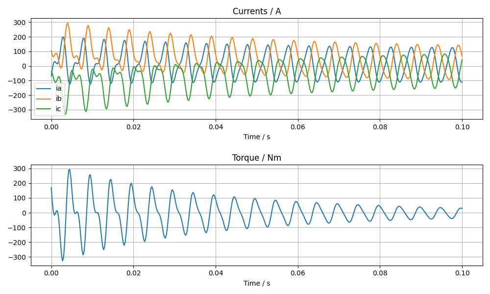

**FE-Simulation**
=================

Cogging (cogg_calc)
~~~~~~~~~~~~~~~~~~~

==============  ============================= ==========  ============
Parameter        Description                   Default      Unit
==============  ============================= ==========  ============
speed           Speed                                     1/s
skew_angle      Skewing angle                   0         deg
num_skew_steps  Number of skew steps            0
magn_temp       Magnet Temperature                        °C
num_move_steps  Number of move steps
num_par_wdgs    Number of parallel windings     1
eval_force      Evaluate force                  0
period_frac     Rotate Fraction of Period       1
vtu_movie       Create VTU files                False
==============  ============================= ==========  ============

Example::

  simulation = dict(
    calculationMode="cogg_calc",
    magn_temp=60.0,
    num_move_steps=49,
    speed=50.0)

PM/Rel Machine Simulation (pm_sym_fast)
~~~~~~~~~~~~~~~~~~~~~~~~~~~~~~~~~~~~~~~

==============  ======================================= ========  ============
Parameter        Description                            Default      Unit
==============  ======================================= ========  ============
speed           Speed                                              1/s
skew_angle      Skewing angle                           0          deg
num_skew_steps  Number of skew steps                    0
magn_temp       Magnet Temperature                                 °C
wind_temp       Winding Temperature                     20         °C
num_move_steps  Number of move steps                    49
num_par_wdgs    Number of parallel windings             1
eval_force      Evaluate force                          0
current         Phase current                                      A (RMS)
angl_i_up       Angle I vs. Up                          0          deg
optim_i_up      Optimize Current                        0
phi_start       Start angle of rotation                 0          deg
range_phi       Rotation angle                          360/p      deg
explicit_mode   Deactivate rotation correction          0
plots           Create plots                            []
airgap_induc    calculate airgap induction              False
period_frac     Rotate Fraction of Period               1
calc_noload     Calculate no load                       1
magnet_loss     Extended magnet loss calc  (IALH)       False
poc             Current shape definition                (none)
vtu_movie       Create VTU files                        False
==============  ======================================= ========  ============

.. Note::

   plots is a list of field_lines or color_gradation plots to be created after the calculation. Possible values
   'field-lines', 'Babs', 'Br', 'Bx', 'By', 'Br', 'Bt', 'Habs', 'Hx', 'Hy', 'Hr', 'Ht'
   'demag', 'ecurr', 'ecloss', 'relperm', 'Wm', 'Bdev', 'Vpot'. (See http://script.profemag.ch/ColorGrad.html) added in version 0.0.16. The value types can be simple strings or list with name and min/max range.

Example::

  simulation = dict(
    calculationMode="pm_sym_fast",
    wind_temp=60.0,
    magn_temp=60.0,
    current=50.0,
    speed=50.0,
    plots=['field_lines', ['Babs', 0.0, 2.5]])

.. Note::
   If airgap_induc is True the induction in the airgap is calculated after the simulation returns. The values can be read with the method read_airgap_induc() of call Femag.

   ==============  ============================= ============
   Parameter        Description                  Unit
   ==============  ============================= ============
   Baml            Amplitude of base harmonic    T
   phi0            Phase angle of base harmonic  rad
   pos             Position                      ° or mm
   B               sampled values                T
   B_fft           Values of base harmonic       T
   ==============  ============================= ============

   .. image:: ../img/airgapinduc.png
      :height: 240pt

.. Note::
   The poc class is used to define current shape: sin, rec, har, hsp, fun

   ==============  ============================= ============
   Parameter        Description                  Unit
   ==============  ============================= ============
   pole_pitch      pole pitch
   key_winding     list of key ids
   ==============  ============================= ============

Short circuit calculation (shortcircuit)
~~~~~~~~~~~~~~~~~~~~~~~~~~~~~~~~~~~~~~~~

The short circuit calculation is executed subsequentially to a pm_sym_fast simulation
if shortCircuit is set True. (version added 0.9.30). The results are included in scData dict of bch

   ==============  ===================================== ==========  ==========
   Parameter        Description                          Default      Unit
   ==============  ===================================== ==========  ==========
   shortCircuit    run short circuit calc if True
   l_end_winding   winding inductance                    0           H
   l_external      External inductance                   0           H
   sc_type         type of short circuit (3-phase)       3
   simultime       Simulation time                       0.1         s
   initial         Initial condition 1: noload 2: load   2
   allow_demagn    Allow Demagnetisation:1:yes; 0:no     0
   sim_demagn      Simulate Demagnetisation:1:yes; 0:no  0
   ==============  ===================================== ==========  ==========

   Example::

     pmRelSim = dict(
        angl_i_up=-39.3,
        calculationMode="pm_sym_fast",
        wind_temp=60.0,
        magn_temp=60.0,
        current=76.43,
        period_frac=6,
        speed=50.0,
        shortCircuit=True,
        l_end_winding=0,
        l_external=0,
        sc_type=3,
        initial=2,
        allow_demagn=0,
        sim_demagn=1)

     r = femag(machine, pmRelSim)

     print('Torque [Nm] = {}'.format(r.machine['torque']))
     print('''
       Short Circuit    Current         Torque
         Peak       iks {2:8.1f} A  tks {3:8.1f} Nm
         Stationary ikd {0:8.1f} A  tkd {1:8.1f} Nm

       peak winding currents {4}
     '''.format(r.scData['ikd'],
                r.scData['tkd'],
                r.scData['iks'],
                r.scData['tks'],
                r.scData['peakWindingCurrents']))

     fig, ax = plt.subplots()
     femagtools.plot.transientsc(r)
     plt.show()

SM Machine Simulation (pm_sym_f_cur)
~~~~~~~~~~~~~~~~~~~~~~~~~~~~~~~~~~~~

==============  ======================================= ========  ============
Parameter        Description                            Default      Unit
==============  ======================================= ========  ============
speed           Speed                                              1/s
skew_angle      Skewing angle                           0          deg
num_skew_steps  Number of skew steps                    0
wind_temp       Winding Temperature                     20         °C
num_move_steps  Number of move steps                    49
num_par_wdgs    Number of parallel windings             1
eval_force      Evaluate force                          0
current         Phase current                                      A (RMS)
nload_ex_cur    No-Load excitation current              0          A
load_ex_cur     Load excitation current                 0          A
angl_i_up       Angle I vs. Up                          0          deg
optim_i_up      Optimize Current                        0
phi_start       Start angle of rotation                 0          deg
range_phi       Rotation angle                          360/p      deg
explicit_mode   Deactivate rotation correction          0
plots           Create plots                            []
airgap_induc    calculate airgap induction              False
period_frac     Rotate Fraction of Period               1
vtu_movie       Create VTU files                        False
==============  ======================================= ========  ============

Ld-Lq Identification (ld_lq_fast)
~~~~~~~~~~~~~~~~~~~~~~~~~~~~~~~~~

==============  ============================= ==========  ============
Parameter        Description                   Default      Unit
==============  ============================= ==========  ============
speed           Speed                                     1/s
skew_angle      Skewing angle                   0         deg
num_skew_steps  Number of skew steps            0
magn_temp       Magnet Temperature                        °C
num_move_steps  Number of move steps
num_par_wdgs    Number of parallel windings     1
eval_force      Evaluate force                  0
i1_max          Max. phase current                        A (RMS)
beta_min        Min. Beta angle                           deg
beta_max        Max. beta angle                           deg
num_cur_steps   Number of current steps
num_beta_steps  Number of beta steps
period_frac     Rotate Fraction of Period       1
==============  ============================= ==========  ============

Example::

  simulation = dict(
    num_move_steps=25,
    calculationMode="ld_lq_fast",
    magn_temp=60.0,
    i1_max=150.0,
    beta_max=0.0,
    beta_min=-60.0,
    num_cur_steps=3,
    num_beta_steps"=4,
    speed=50.0)

Psid-Psiq Identification (psd_psq_fast)
~~~~~~~~~~~~~~~~~~~~~~~~~~~~~~~~~~~~~~~

==============  ============================= ==========  ============
Parameter        Description                   Default      Unit
==============  ============================= ==========  ============
speed           Speed                                     1/s
skew_angle      Skewing angle                   0         deg
num_skew_steps  Number of skew steps            0
magn_temp       Magnet Temperature                        °C
num_move_steps  Number of move steps
num_par_wdgs    Number of parallel windings     1
eval_force      Evaluate force                  0
maxid           Max. Amplitude Id current                 A
minid           Min. Amplitude Id current                 A
maxiq           Max. Amplitude Iq current                 A
miniq           Min. Amplitude Iq current                 A
delta_id        Delta of Id current steps                 A
delta_iq        Delta of Iq current steps                 A
period_frac     Rotate Fraction of Period       1
==============  ============================= ==========  ============

Example::

  simulation = dict(
    num_move_steps=25,
    calculationMode="psd_psq_fast",
    magn_temp=60.0,
    maxid=0.0,
    minid=-150.0,
    maxiq=150.0
    miniq=0.0,
    delta_id=50.0,
    delta_iq=50.0,
    speed=50.0)

PM/Rel Torque Calc (torq_calc)
~~~~~~~~~~~~~~~~~~~~~~~~~~~~~~

similar to pm_sym_fast without noload calc (Note: requires a correct Poc)

==============  ============================= ==========  ============
Parameter        Description                   Default      Unit
==============  ============================= ==========  ============
speed           Speed                                     1/s
skew_angle      Skewing angle                   0         deg
num_skew_steps  Number of skew steps            0
magn_temp       Magnet Temperature                        °C
wind_temp       Winding Temperature             20        °C
num_move_steps  Number of move steps            49
num_par_wdgs    Number of parallel windings     1
current         Phase current                             A (RMS)
poc             Current shape definition        (none)
angl_i_up       Angle I vs. Up                  0         deg
==============  ============================= ==========  ============

Example::

  simulation = dict(
    calculationMode="torq_calc",
    wind_temp=60.0,
    magn_temp=60.0,
    current=50.0,
    angl_i_up=0.0,
    speed=50.0)

FE-Simulation with existing model
---------------------------------

FE calculations can be executed for existing models also.
Since Femag Rel 8.3 there is no need to fully specify the machine model::

  machine = "PM 270 L8"

  workdir = os.path.join(
    os.path.expanduser('~'), 'femag')

  femag = femagtools.Femag(workdir)

  simulation = dict(
    angl_i_up=-38.7,
    calculationMode="pm_sym_fast",
    magn_temp=60.0,
    num_move_steps=25,
    speed=50.0,
    wind_temp=60.0,
    current=108.0)

  r = femag(machine, simulation)

For older FEMAG versions the minimal data is::

  machine = dict(
      name="PM 130 L4",
      lfe=0.1,
      poles=4,
      outer_diam=0.13,
      bore_diam=0.07,
      airgap=0.001,

      stator=dict(
          num_slots=12,
          num_slots_gen=3,
          mcvkey_yoke="dummy"
      )
  )
