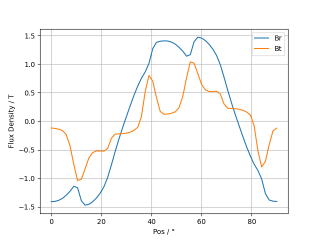
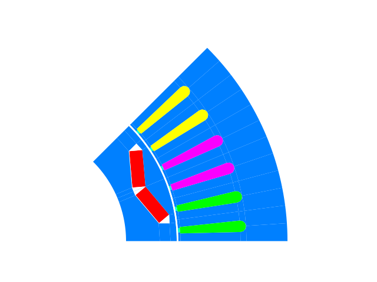
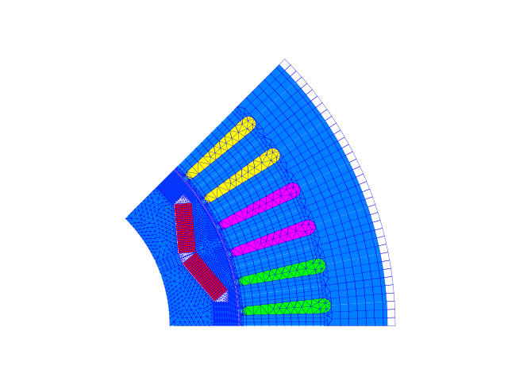

Model File (NC/I7) Processing
*****************************

The FEMAG models and many simulation results are saved into files with extension nc
which is based on the open standard format `NetCDF <https://www.unidata.ucar.edu/software/netcdf>`_
For FEMAG releases earlier than 9.0 the extension is I7/A7 (windows) or ISA7/AUX7 (unix) which is a proprietary format.

For both file formats corresponding modules nc and isa7 exist (filename extension is optional)::

  isa = femagtools.isa7.read('foo')
  nc = femagtools.nc.read('foo')

The file is structured as follows:

.. figure:: img/ncformat.png

in addition following general data is provided:

====================  ======================================  ======
Parameter             Description                             Unit
====================  ======================================  ======
FC_RADIUS             radius to center of airgap              m
arm_length            Effective lenght of iron                m
num_poles             Number of poles
pole_pairs            Number of pole pairs
poles_sim             Number of poles in model
num_slots             Number of slots
delta_node_angle      Angle between 2 nodes in airgap         rad
pos_el_fe_induction   rotation positions (mpos)               rad
el_fe_induction_1     flux density comp 1 (radial)            T
                      (nel, mpos, icur, ibeta)
el_fe_induction_2     flux density comp 2 (tangential)        T
                      (nel, mpos, icur, ibeta)
eddy_cu_vpot          eddy current vector potential
                      (nel, mpos, icur, ibeta)
====================  ======================================  ======

Example::

  plt.plot(nc.pos_el_fe_induction*180/np.pi,
           nc.el_fe_induction_1[0, :, 0, 1], label='Br')
  plt.plot(nc.pos_el_fe_induction*180/np.pi,
           nc.el_fe_induction_2[0, :, 0, 1], label='Bt')
  plt.xlabel('Pos / °')
  plt.ylabel('Flux Density / T')
  plt.grid()
  plt.legend()

The plot module provides functions for plotting the subregions and mesh::

  femagtools.plot.mesh(nc)
  femagtools.plot.spel(nc)

