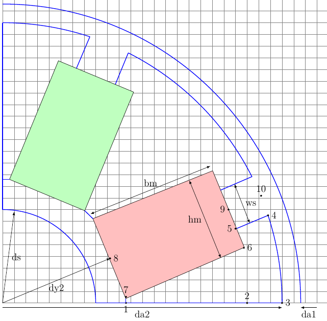
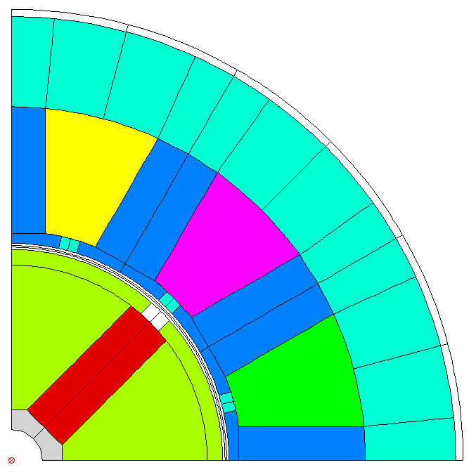

User Specified Magnet Geometries
================================

Magnet geometries not covered by the built in models can be specified by fsl code. Here is a example:

   Example of a user specified geometry (created with `TikZ <http://www.texample.net/tikz>`_)

The procedure is as follows:

1. Create a diagram of the geometry and decide about the parameters to be used.
2. Create a fsl mako template file with the chosen parameters as placeholders
      using the `Mako <http://www.makotemplates.org>`_ syntax with ${}.
3. Include this filename in the magnet model within the section using the basename of the mako file
   and set the parameter values.

The following values are defined globally and can be referenced in the template:

==============  =========================== =======
Name            Description                 Unit
==============  =========================== =======
mcvkey_yoke     lamination material of yoke 
mcvkey_shaft    material of shaft
m.remanenc      Remanence Induction         T
m.relperm       Rel. Permeability of PM
m.num_poles     Number of poles
m.npols_gen     Number of poles in model
agndst          Node distance in airgap     m
dy1             Diameter of stator yoke     m
da1             Diameter of stator bore     m
da2             Diameter of rotor           m
dy2             Diameter of rotor yoke      m
==============  =========================== =======

Example FSL Template file spoke.mako using 4 parameters::

  -- Model parameters

  ds = ${model['shaft_diam']}*1e3
  hm = ${model['magn_height']}*1e3
  bm = ${model['magn_width']}*1e3
  ws = ${model['slot_width']}*1e3

  -- calculate slot height and pole pitch
  hs = (da2-dy2)/2 - bm   
  taup = math.pi/m.num_poles

  x = {}
  y = {} 

  -- characteristic points of model

  ar = math.sqrt(dy2^2+hm^2)/2
  x[1] = ar*math.cos(taup - math.atan2(hm/2, dy2/2))
  y[1] = 0
  x[2],y[2] = pr2c(dy2/2+bm, 0)
  x[3],y[3] = pr2c(da2/2, 0)
  x[4],y[4] = pr2c(da2/2, taup - math.atan2(ws/2,(da2/2)))
  x[5],y[5] = pr2c(da2/2-hs, taup - math.atan2(ws/2,(da2/2 - hs)))
  x[6],y[6] = pr2c(da2/2-hs, taup - math.atan2(hm/2, da2/2-hs))
  x[7],y[7] = pr2c(ar, taup - math.atan2(hm/2, dy2/2))
  x[8],y[8] = pr2c(dy2/2, taup)
  x[9],y[9] = pr2c(da2/2 - hs, taup)
  x[10],y[10] = pr2c(da2/2, taup)
  
Magnet definition in Python file with included fsl file and the parameter definition::

  ..
  magnet=dict(
      mcvkey_yoke="dummy",
      spoke=dict(
          magn_height=0.008,
          shaft_diam=0.01,
          slot_width=0.004,
          magn_width=0.024
      )
   ..

The resulting model:

	    
.. note::

   Starting with Release 0.4.4 the syntax has changed but backward compatibility is fully supported.
   
   the complete example can be found in `stator1-spoke.py <https://github.com/SEMAFORInformatik/femagtools/blob/master/examples/model-creation/stator1-spoke.py>`_ and `spokefml.fsl <https://github.com/SEMAFORInformatik/femagtools/blob/master/examples/model-creation/spokefml.fsl>`_ in the example directory on github.
