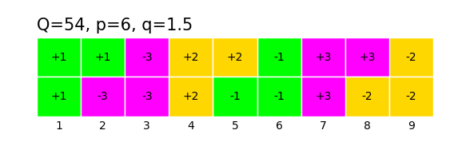
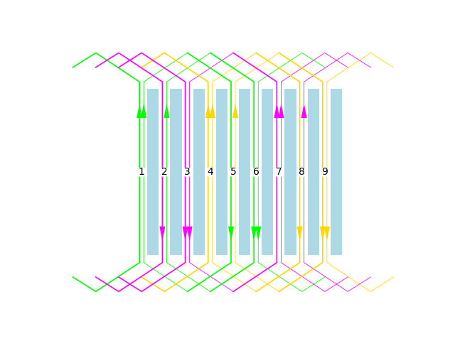
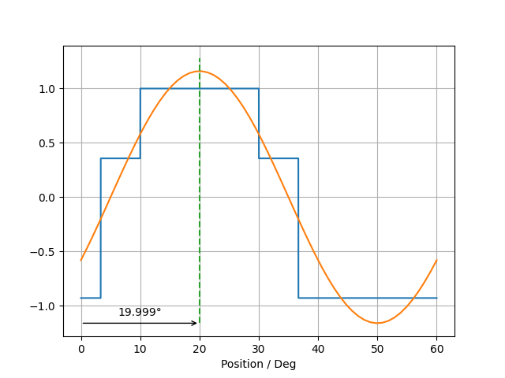
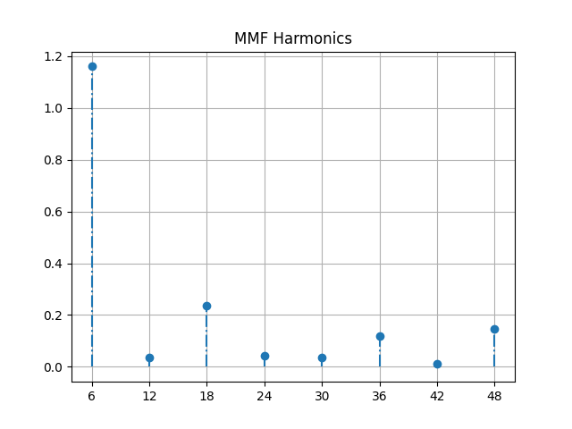

Windings
********

The windings module provides utility functions and the class
Windings to define and analyze windings.

Example of a symmetric 3-phase, 2-layer Winding with 54 slots and 6 pole pairs::

  w = femagtools.windings.Winding(dict(Q=54, p=6, m=3, l=2))

  assert wdg.yd == 4
    assert wdg.zoneplan() == (
        [[1, 2, -6], [4, 5, -9], [-3, 7, 8]],
        [[1, -5, -6], [4, -8, -9], [-2, -3, 7]])

  femagtools.plot.zoneplan(w)

Zone plan::

  femagtools.plot.winding(w)

MMF::

  mmf = w.mmf()
  femagtools.plot.mmf(mmf)
  femagtools.plot.mmf_fft(mmf)

Custom Windings
===============

Example of a custom defined winding::

  w = femagtools.windings.Winding(dict(
    Q=12, p=5, m=3,
    1: {'N': [10, 10, 10, 10],
        'layer': [1, 2, 1, 2],
        'slots': [1, 1, -2, 6]},
    2: {'N': [10, 10, 10, 10],
        'layer': [2, 1, 2, 1],
        'slots': [-4, 5, 5, -6]},
    3: {'N': [10, 10, 10, 10],
        'layer': [2, 1, 2, 1],
        'slots': [2, -3, -3, 4]}})
  ))
